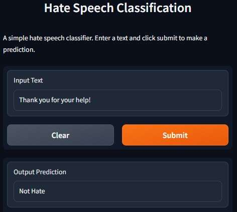

# Hate Speech Classification
[](https://huggingface.co/spaces/soumyaprabhamaiti/hate_speech_classifier)

A project to classify the input text as hate speech or not using an LSTM model trained on the [Hate Speech and Offensive Language dataset](https://www.kaggle.com/mrmorj/hate-speech-and-offensive-language-dataset) and [Twitter hate speech](https://www.kaggle.com/datasets/vkrahul/twitter-hate-speech) dataset from Kaggle.

## Demo
The deployed version of this project can be accessed at [Hugging Face Spaces](https://huggingface.co/spaces/soumyaprabhamaiti/hate_speech_classifier). A demo of the app is shown below:



## Dataset

The dataset used in this project is a combination of the [Hate Speech and Offensive Language dataset](https://www.kaggle.com/mrmorj/hate-speech-and-offensive-language-dataset) and [Twitter hate speech](https://www.kaggle.com/datasets/vkrahul/twitter-hate-speech) dataset. The combined dataset contains 56,745 tweets belonging to 3 classes: hate speech, offensive language, and neither, among which the first two are merged to form the final hate speech class. The modified dataset thus formed is an almost balanced dataset with 2 classes - hate speech and not a hate speech. The dataset is split into 80% training and 20% validation sets.

## Model Architecture

The model used in this project is a simple LSTM model with an embedding layer, a dropout layer and a dense layer.

The detailed architecture of the model used in this project is shown below:
```
Model: "sequential"
_________________________________________________________________
 Layer (type)                Output Shape              Param #   
=================================================================
 embedding (Embedding)       (None, 300, 100)          5000000   
                                                                 
 spatial_dropout1d (SpatialD  (None, 300, 100)         0         
 ropout1D)                                                       
                                                                 
 lstm (LSTM)                 (None, 100)               80400     
                                                                 
 dense (Dense)               (None, 1)                 101       
                                                                 
=================================================================
Total params: 5,080,501
Trainable params: 5,080,501
Non-trainable params: 0
_________________________________________________________________
```

<!-- ## Performance

The model was trained for 10 epochs with a batch size of 64. The training and validation accuracy and loss curves are shown below:  


The model achieved an accuracy of 96.5% on the validation set. -->

## Libraries Used

The following libraries were used in this project:

- TensorFlow: To build segmentation model.
- Gradio: To create the user interface for the segmentation app.

## Installing Locally

To run this project locally, please follow these steps:

1. Clone the repository:

   ```
   git clone https://github.com/soumya-prabha-maiti/hate-speech-classification
   ```

2. Navigate to the project folder:

   ```
   cd hate-speech-classification
   ```

3. Install the required libraries:

   ```
   pip install -r requirements.txt
   ```

4. Run the application:

   ```
   python app.py
   ```

5. Access the application in your web browser at the specified port.

## License

This project is licensed under the [MIT License](LICENSE).